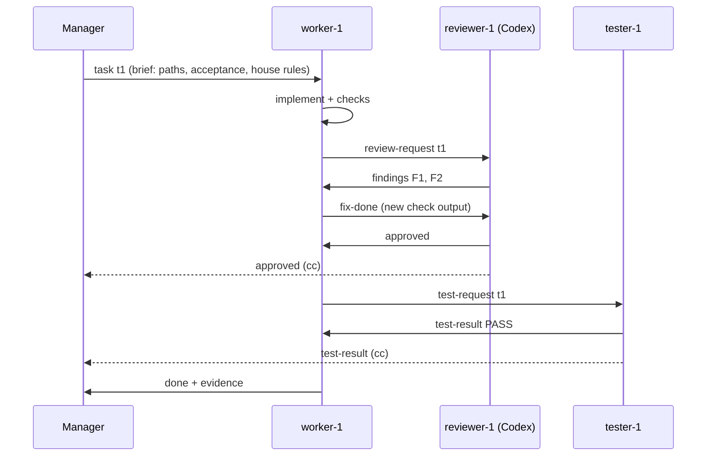

# zstack

A manager-led agent team built from how you actually work in Claude Code, Codex, opencode, pi and omp.

You talk to **one manager**. It classifies your message, sizes the work with **Jev**, and spawns up to **100 agents** (at most 8 at once by default) across harnesses. Those agents message each other to build, review, debug and test. The manager reports only after cross-model review, real checks and a final independent verification.

- `docs/DESIGN.md`: architecture, caps, sizing table, bus protocol, and how zen-workflow, herdr, the Codex lanes and `claude-review` fit in.

## Start

```bash
cd ~/Project/<repo>
~/Project/zstack/bin/zstack up            # = claude --plugin-dir ~/Project/zstack --agent zstack:manager
```

Then talk normally: "wdyt about…", "create the plan", "review the current changes", "fix X, then commit and push", "retrigger until it works", "status?", "remember: never commit docs".

Headless: `claude -p --plugin-dir ~/Project/zstack --agent zstack:manager --permission-mode auto "<request>"`.

## How it flows

The manager first works out what kind of message you sent. Only the execute path changes code.


### Build loop (squad, team and swarm)


### Agents talking over the bus



### Team sizes

| size | when | agents |
|---|---|---|
| solo | trivial, one obvious edit | 0 (manager does it) |
| pair | one focused change | 1 worker + 1 reviewer |
| squad | 2–4 independent units | ≤4 workers, 2 reviewers, 1 tester, scouts, verifier |
| team | 5–12 units or several repos | ≤12 workers, 1 reviewer per 3 workers, 1 tester per 4 workers, planner, verifier, scribe |
| swarm | 13+ units | ≤60 workers, scaled to fit under the 100 cap (10 kept in reserve) |

Jev picks the size. To force one, say "use a team", "use 8 agents" or "no subagents".

## What's inside

| path | what |
|---|---|
| `agents/` | manager, scout, planner, worker, reviewer, tester, debugger, operator, verifier, scribe (Claude Code plugin agents; `zstack brief` reuses them for other harnesses) |
| `skills/zstack` | the manager playbook: intent → size → flow → spawn → monitor → gates → report |
| `skills/zstack-bus` | how agents talk: message kinds, handoffs, evidence format |
| `skills/zstack-jev` | the exact Jev questions: size, route, loop, finding, approve, scope, complete |
| `skills/zstack-review` | review rubric and personas (code, architecture, security, contract, scope, infra) |
| `skills/zstack-verify` | verification ladder: static → unit → e2e → run → browser → parity/bench → live |
| `skills/zstack-debug` | root-cause loop used after two failed fixes |
| `skills/zstack-git` | git policy (default: no commit, current branch, no worktree) |
| `rules/house.md` | your standing rules, injected into every agent brief |
| `config/zstack.toml` | caps and role → harness/model routing (reviewers default to Codex for cross-model review) |
| `bin/zstack` | stdlib-only Python CLI: run ledger, task graph, message bus, caps, Jev sizing, briefs, cross-harness spawn |
| `tests/` | `python3 -m unittest discover tests` |

## CLI cheat sheet

```bash
zstack init --goal "split league service" --repo . [--git commit-push] [--worktree per-writer] [--deploy authorized]
echo '{"request":"…","units":6}' | zstack size        # Jev → intent, tier, flow, counts per role
zstack agent add --role worker --task t1 [--harness codex --model gpt-6-luna]
zstack brief worker-1                                # brief for an in-session subagent
zstack spawn reviewer-1                              # headless agent on its harness; posts `done` when it exits
zstack msg send --to worker-1 --kind findings --ref t1 --body "F1 …"
zstack --as worker-1 msg wait --kind findings,approved
zstack task add --title … --paths internal/league --deps t1 --accept "…"
zstack task set t1 --state done --evidence "go test ./league/... ok"
zstack status | zstack report | zstack close
zstack rule add "never put code in cmd/" --project   # remembered for every future brief
```

State lives in `~/.local/state/zstack/` (override with `ZSTACK_HOME`), never in your repo.

## Optional install

`./install.sh` puts `zstack` on your PATH and links the skills into `~/.agents/skills` (Codex, pi and omp read skills from there). `./install.sh --codex-agents` also generates `~/.codex/agents/zstack-*.toml`. The script never edits existing files. For Claude Code, `zstack up` loads the plugin with `--plugin-dir`, so nothing needs installing.
