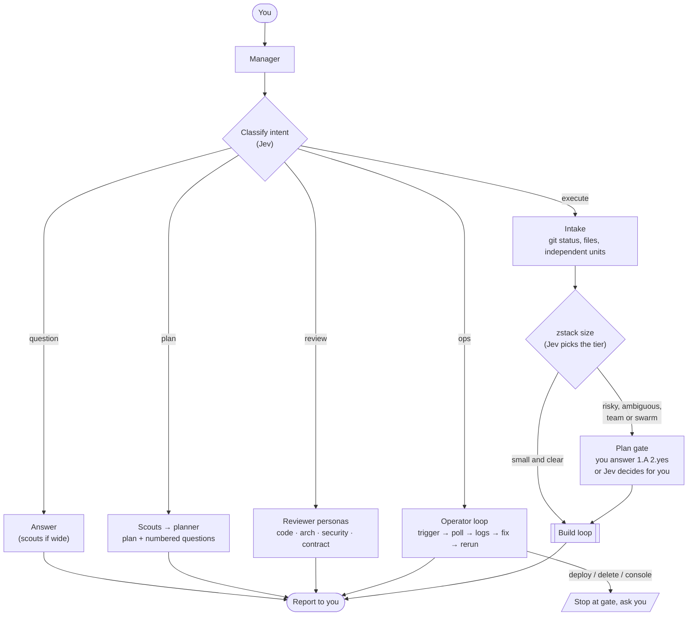
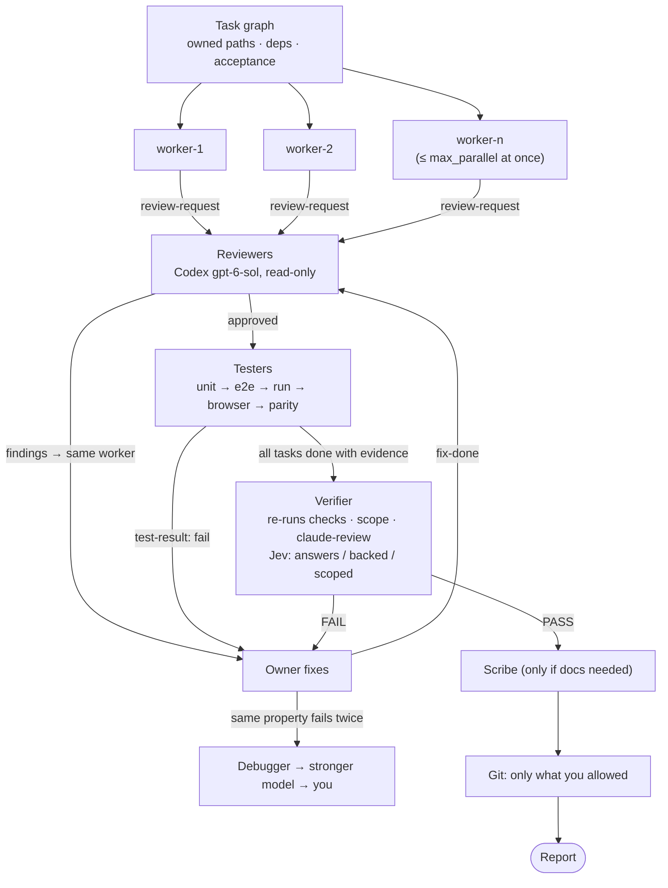
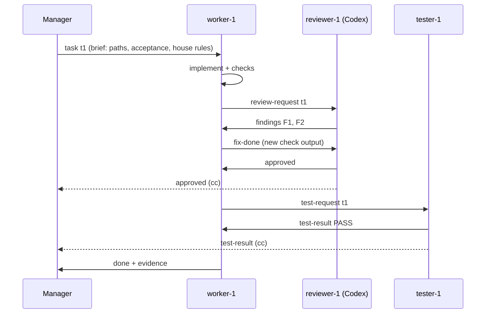

# zstack

A manager-led agent team built from how you actually work in Claude Code, Codex, opencode, pi and omp.

You talk to **one manager**. It classifies your message, sizes the work with **Jev**, and spawns up to **100 agents** (at most 8 at once by default) across harnesses. Those agents message each other to build, review, debug and test. The manager reports only after cross-model review, real checks and a final independent verification.

- `docs/DESIGN.md`: architecture, caps, sizing table, bus protocol, and how zen-workflow, herdr, the Codex lanes and `claude-review` fit in.

## Start

```bash
cd ~/Project/<repo>
zstack                     # manager in Claude Code (claude --plugin-dir ~/Project/zstack --agent zstack:manager)
zstack --host codex        # manager in Codex
zstack --host omp          # manager in omp
zstack --host pi           # manager in pi
zstack --host opencode     # manager in opencode
zstack --host codex -- -m gpt-6-sol   # anything after -- goes to the harness
zstack --host omp --dry-run           # print the launch command instead
```

Then talk normally: "wdyt about…", "create the plan", "review the current changes", "fix X, then commit and push", "retrigger until it works", "status?", "remember: never commit docs".

Headless: `claude -p --plugin-dir ~/Project/zstack --agent zstack:manager --permission-mode auto "<request>"`.

### Hosts

| host | how the manager is loaded | default team (config `[hosts.<host>.roles]`) |
|---|---|---|
| claude | plugin agent `zstack:manager` | workers Sonnet in-session, reviewers Codex gpt-6-sol, verifier Opus |
| codex | manager prompt as `developer_instructions`, workspace-write sandbox + network | workers/scouts gpt-6-luna, planner/debugger gpt-6-sol, reviewers Claude Sonnet, verifier Opus |
| omp | `--append-system-prompt` | workers DeepSeek v4.1 flash (Command Code), scouts luna, planner GLM 5.3 flash, reviewers Codex sol, verifier Opus |
| pi | `--append-system-prompt` | workers luna, planner/debugger sol (openai-codex), reviewers Claude Sonnet, verifier Opus |
| opencode | inline `zstack-manager` agent via `OPENCODE_CONFIG_CONTENT` | workers DeepSeek v4.1 flash (opencode-go), planner/reviewer/debugger Codex sol, verifier Opus |

Outside Claude Code the manager spawns every agent through `zstack spawn` (there is no Agent tool). Codex runs each shell command in a sandbox that kills its child processes, so for `--host codex` the launcher also starts a small dispatcher outside the sandbox: `zstack spawn` queues the agent and the dispatcher starts it. Reviewers always come from a different model family than the workers.

## How it flows

The manager first works out what kind of message you sent. Only the execute path changes code.



### Build loop (squad, team and swarm)



### Agents talking over the bus



### Team sizes

| size | when | agents |
|---|---|---|
| solo | trivial, one obvious edit | 0 (manager does it) |
| pair | one focused change | 1 worker + 1 reviewer |
| squad | 2–4 independent units | ≤4 workers, 2 reviewers, 1 tester, scouts, verifier |
| team | 5–12 units or several repos | ≤12 workers, 1 reviewer per 3 workers, 1 tester per 4 workers, planner, verifier, scribe |
| swarm | 13+ units | ≤60 workers, scaled to fit under the 100 cap (10 kept in reserve) |

Jev picks the size. To force one, say "use a team", "use 8 agents" or "no subagents".

## What's inside

| path | what |
|---|---|
| `agents/` | manager, scout, planner, worker, reviewer, tester, debugger, operator, verifier, scribe (Claude Code plugin agents; `zstack brief` reuses them for other harnesses) |
| `skills/zstack` | the manager playbook: intent → size → flow → spawn → monitor → gates → report |
| `skills/zstack-bus` | how agents talk: message kinds, handoffs, evidence format |
| `skills/zstack-jev` | the exact Jev questions: size, route, loop, finding, approve, scope, complete |
| `skills/zstack-review` | review rubric and personas (code, architecture, security, contract, scope, infra) |
| `skills/zstack-verify` | verification ladder: static → unit → e2e → run → browser → parity/bench → live |
| `skills/zstack-debug` | root-cause loop used after two failed fixes |
| `skills/zstack-git` | git policy (default: no commit, current branch, no worktree) |
| `rules/house.md` | your standing rules, injected into every agent brief |
| `config/zstack.toml` | caps and role → harness/model routing (reviewers default to Codex for cross-model review) |
| `bin/zstack` | stdlib-only Python CLI: run ledger, task graph, message bus, caps, Jev sizing, briefs, cross-harness spawn |
| `tests/` | `python3 -m unittest discover tests` |
| `mods/` | Claude Code mods (below); `.claude-plugin/marketplace.json` lists zstack and every mod |

## CLI cheat sheet

```bash
zstack init --goal "split league service" --repo . [--git commit-push] [--worktree per-writer] [--deploy authorized]
echo '{"request":"…","units":6}' | zstack size        # Jev → intent, tier, flow, counts per role
zstack agent add --role worker --task t1 [--harness codex --model gpt-6-luna]
zstack brief worker-1                                # brief for an in-session subagent
zstack spawn reviewer-1                              # headless agent on its harness; posts `done` when it exits
zstack msg send --to worker-1 --kind findings --ref t1 --body "F1 …"
zstack --as worker-1 msg wait --kind findings,approved
zstack msg log --kind blocker,question --tail 5
zstack task add --title … --paths internal/league --deps t1 --accept "…"
zstack task set t1 --state done --evidence "go test ./league/... ok"
zstack status | zstack report | zstack close
zstack rule add "never put code in cmd/" --project   # remembered for every future brief
```

State lives in `~/.local/state/zstack/` (override with `ZSTACK_HOME`), never in your repo.

## Optional install

`./install.sh` puts `zstack` on your PATH and links the skills into `~/.agents/skills` (Codex, pi and omp read skills from there). `./install.sh --codex-agents` also generates `~/.codex/agents/zstack-*.toml`. The script never edits existing files. For Claude Code, `zstack` loads the plugin with `--plugin-dir`, so nothing needs installing.

## Mods

Claude Code mods (plugins of function hooks) aimed at the frustrations that come up most in the history. Each is its own plugin under `mods/`, with tests (`claude plugin test mods/<name>`).

| mod | what it does | the pain it targets |
|---|---|---|
| `intent-gate` | Jev classifies each prompt as question / plan / review / execute / ops; on non-execute turns it refuses Edit/Write and git writes with a reason. `/intent execute` or `/intent off` overrides. Fails open when Jev is down. | "why you implement? I only want the docs" |
| `git-guard` | Blocks staging docs/plans, `git add -A`, force push, rebase and amend unless your prompt asked; strips co-author lines. *(landing next)* | committed docs, co-author lines, surprise rebases |
| `stack-blast-radius` | Holds `terraform apply`, `pulumi up`, cloud deletes/deploys and broad SQL writes for a Proceed/Cancel pane with a dry-run preview. *(landing next)* | over-broad deletes, risky infra |
| `secret-vault` | Swaps pasted JWTs, cookies, DSNs, passwords and keys for `⟨secret:N⟩` placeholders before the model sees them, puts real values back only inside commands, masks them in output. `/vault list`. | live secrets in transcripts |
| `loop-breaker` | After the same failure twice (or the same error pasted again) tells the model to stop patching and diagnose. | "still same ahh" loops |
| `evidence-check` | Flags a reply that claims "tests pass / fixed / verified" when no test or check ran that turn. | "you said it pass?" |
| `ship-state` | Band above the prompt: branch, ↑↓ vs upstream, staged/modified/untracked, last test result. | "already pushed to main?" |
| `rules-injector` | Adds your `zstack rule` list (house + global + project) to every session's system prompt; `/rules add …`. | forgotten standing rules |
| `zstack-pane` | `/zs` opens a live pane of the current zstack run: agents, tasks, blockers, and a steer box. | supervising runs |
| `usage-meter` | Status line with context %, tokens and rate-limit usage. | cost and rate limits |
| `turn-done-alert` | Toast when a long turn ends or when Claude is waiting on you; a heartbeat while a turn runs long. | "is it stuck?" |
| `tool-fold` | Click ▸ on a tool call to see its full command, file, diff or prompt (and full Bash output); ▾ folds it. | truncated tool rows |

Try one in a single session:

```bash
claude --plugin-dir ~/Project/zstack/mods/git-guard
```

Install for every session:

```bash
claude plugin marketplace add zainokta/zstack        # or a local path: ~/Project/zstack
claude plugin install intent-gate@zstack --scope user
```

Guards (intent-gate, git-guard, stack-blast-radius) read command text, so a script or `$(…)` can get past them. Keep permission rules for hard blocks.
